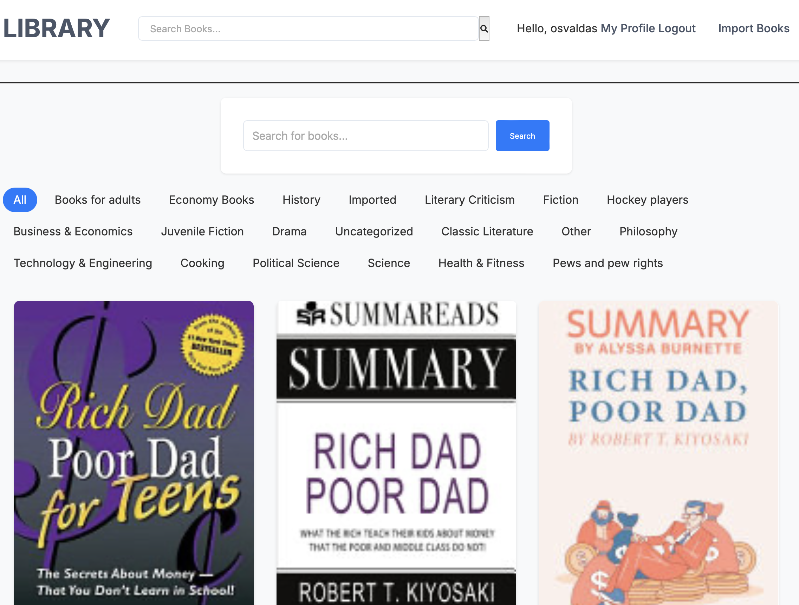

# Digital Library




## Overview
Digital Library is a web application that allows users to discover, borrow, and read a collection of digital books. The application provides features for searching books, filtering by topics, and managing user activities.

## Features
- Search for books by title, author, or topic.
- Browse books by categories (topics).
- View detailed information about each book.
- Import books from external sources (e.g., Google Books API).
- User authentication and activity logging.

## Technologies Used
- **Backend**: Django
- **Frontend**: HTML, CSS, JavaScript
- **Database**: PostgreSQL (or SQLite for development)
- **APIs**: Google Books API for book data

## Installation

### Prerequisites
- Python 3.x
- Django
- PostgreSQL (or SQLite)
- pip

### Steps
1. Clone the repository:
   ```bash
   git clone https://github.com/yourusername/digital-library.git
   cd digital-library
   ```

2. Create a virtual environment:
   ```bash
   python -m venv venv
   source venv/bin/activate  # On Windows use `venv\Scripts\activate`
   ```

3. Install the required packages:
   ```bash
   pip install -r requirements.txt
   ```

4. Set up the database:
   - Create a PostgreSQL database and user.
   - Update the `DATABASES` setting in `settings.py` with your database credentials.

5. Run migrations:
   ```bash
   python manage.py migrate
   ```

6. Create a superuser (optional):
   ```bash
   python manage.py createsuperuser
   ```

7. Run the development server:
   ```bash
   python manage.py runserver
   ```

8. Open your browser and go to `http://127.0.0.1:8000/`.

## Usage
- Users can register and log in to access the library.
- Use the search bar to find books.
- Click on topics to filter books by category.
- Click on a book to view its details and read it.

## Contributing
Contributions are welcome! Please fork the repository and submit a pull request with your changes.

## License
This project is licensed under the MIT License - see the [LICENSE](LICENSE) file for details.

## Acknowledgments
- [Django](https://www.djangoproject.com/) - The web framework used.
- [Google Books API](https://developers.google.com/books) - For fetching book data.